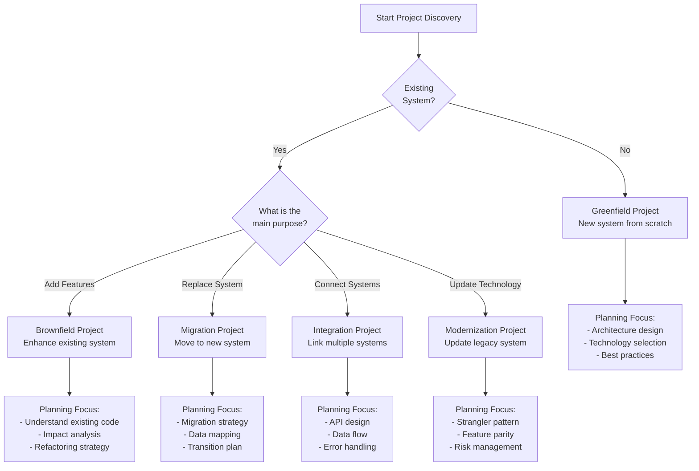
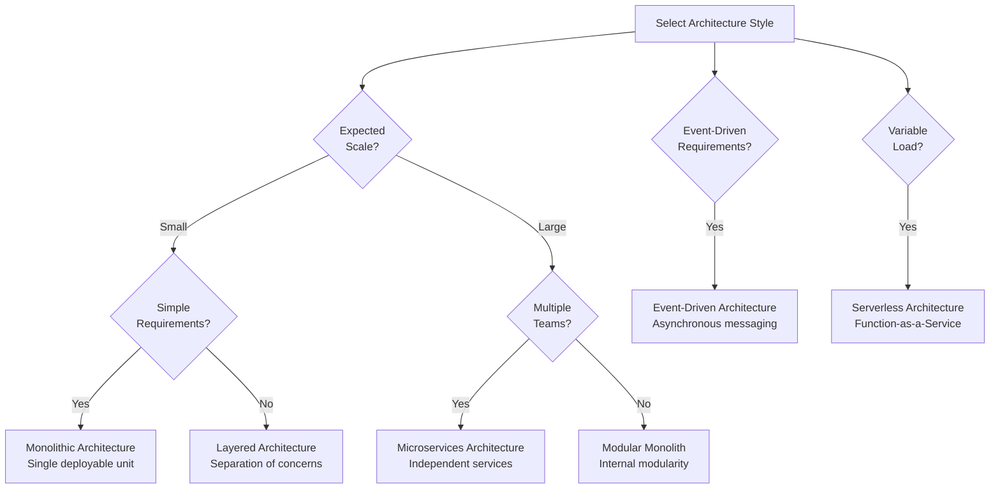
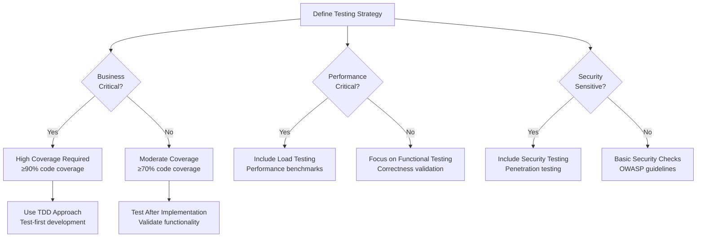
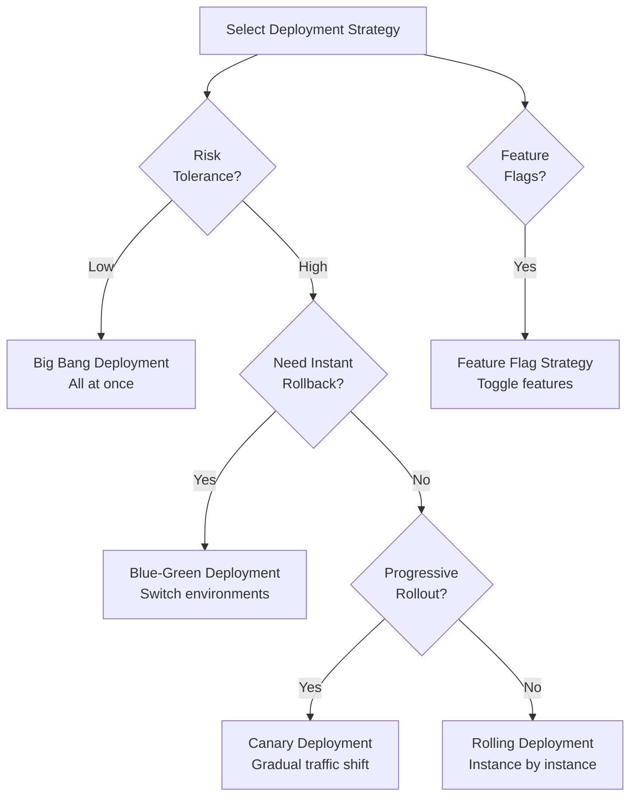

# AI Agent Project Planning Roadmap

**Version**: 1.0.0  
**Purpose**: Universal blueprint for AI agents to plan and organize software projects  
**Applicability**: All project types (web apps, APIs, infrastructure, ML/AI, enterprise systems)  
**Last Updated**: 2026-04-06

---

## Executive Summary

This roadmap provides AI agents with a systematic, comprehensive approach to planning software projects. It is designed to be universally applicable across domains while allowing for domain-specific adaptations.

### What This Roadmap Provides

- **Detailed Procedures**: Step-by-step instructions for each planning phase
- **Decision Trees**: Clear decision points with branching logic using Mermaid diagrams
- **Guiding Principles**: Adaptable best practices for reasoning and judgment
- **Quality Gates**: Comprehensive validation checkpoints with specific metrics, templates, and principles
- **Multi-Agent Coordination**: Patterns for coordinating specialized agents
- **Domain Adaptations**: Specific guidance for different project types

### How to Use This Roadmap

1. **Start with Phase 0**: Always begin with project discovery to understand context
2. **Follow the phases sequentially**: Each phase builds on previous work
3. **Use decision trees**: Navigate choices systematically using provided flowcharts
4. **Apply principles**: Adapt guidelines to your specific project context
5. **Validate at quality gates**: Check all criteria before proceeding to next phase
6. **Document everything**: Maintain clear records of decisions and rationale
7. **Iterate when needed**: Return to earlier phases when new information emerges

### Core Philosophy

- **User-Centric**: Always prioritize user needs and business value
- **Iterative**: Plan in increments, validate frequently, adapt continuously
- **Collaborative**: Coordinate with other agents and stakeholders effectively
- **Quality-Focused**: Build quality in from the start, not as an afterthought
- **Pragmatic**: Balance perfection with practical constraints and deadlines
- **Transparent**: Document decisions and reasoning for future reference

---

## Table of Contents

1. [Planning Principles](#planning-principles)
2. [Phase 0: Project Discovery](#phase-0-project-discovery)
3. [Phase 1: Requirements Analysis](#phase-1-requirements-analysis)
4. [Phase 2: Architecture Design](#phase-2-architecture-design)
5. [Phase 3: Implementation Planning](#phase-3-implementation-planning)
6. [Phase 4: Quality & Testing Strategy](#phase-4-quality--testing-strategy)
7. [Phase 5: Deployment & Operations](#phase-5-deployment--operations)
8. [Phase 6: Documentation & Knowledge Transfer](#phase-6-documentation--knowledge-transfer)
9. [Decision Trees](#decision-trees)
10. [Quality Gates Summary](#quality-gates-summary)
11. [Multi-Agent Coordination](#multi-agent-coordination)
12. [Domain-Specific Adaptations](#domain-specific-adaptations)

---

## Planning Principles

### Principle 1: Understand Before Planning

**Guideline**: Never start planning without understanding the problem space, existing systems, and constraints.

**Why It Matters**: Planning without context leads to solutions that don't fit the actual problem, wasted effort, and rework.

**How to Apply**:
- Ask clarifying questions before making assumptions
- Explore existing systems and documentation
- Identify all stakeholders and their needs
- Understand technical, business, and organizational constraints
- Validate your understanding with stakeholders

**Red Flags** (Anti-patterns to Avoid):
- ❌ Assuming requirements without validation
- ❌ Planning in isolation without gathering context
- ❌ Ignoring existing systems and established patterns
- ❌ Skipping stakeholder input and feedback
- ❌ Making technology choices before understanding needs

### Principle 2: Start with Why

**Guideline**: Every project decision should trace back to a clear business or user need.

**Why It Matters**: Understanding the "why" ensures you're solving the right problem and can make informed trade-offs.

**How to Apply**:
- Document the problem being solved at the start
- Define clear success criteria upfront
- Link every feature to specific user value
- Prioritize based on business impact
- Challenge requirements that lack clear justification

**Key Questions**:
- Why does this project exist?
- What problem does it solve for whom?
- What value does it create?
- What happens if we don't build this?
- How will we measure success?

### Principle 3: Plan for Change

**Guideline**: Assume requirements will evolve; design systems for flexibility and iteration.

**Why It Matters**: Requirements always change. Systems designed for change adapt faster and cost less to modify.

**How to Apply**:
- Use modular, loosely-coupled architecture
- Build in configuration points and feature flags
- Plan for incremental delivery and feedback
- Design reversible decisions where possible
- Avoid premature optimization

**Strategies**:
- **Feature Flags**: Toggle features without redeployment
- **Versioned APIs**: Maintain backward compatibility
- **Pluggable Components**: Swap implementations easily
- **Clear Interfaces**: Enable independent evolution
- **Configuration Over Code**: Change behavior without code changes

### Principle 4: Quality is Non-Negotiable

**Guideline**: Quality must be planned in from the start, not added later.

**Why It Matters**: Retrofitting quality is expensive and often impossible. Quality issues compound over time.

**How to Apply**:
- Define quality metrics and targets upfront
- Plan comprehensive testing strategy early
- Include observability from day one
- Design for reliability, security, and performance
- Automate quality checks in CI/CD

**Quality Dimensions**:
- **Functionality**: Does it work correctly?
- **Reliability**: Does it work consistently?
- **Performance**: Does it work efficiently?
- **Security**: Is it protected from threats?
- **Maintainability**: Can it be changed easily?
- **Usability**: Is it user-friendly?
- **Scalability**: Can it handle growth?

### Principle 5: Document Decisions

**Guideline**: Capture the reasoning behind decisions for future reference and learning.

**Why It Matters**: Future agents (and humans) need to understand why decisions were made to maintain and evolve the system effectively.

**How to Apply**:
- Use Architecture Decision Records (ADRs) for significant choices
- Document trade-offs considered and alternatives rejected
- Record context, constraints, and assumptions
- Explain the reasoning, not just the decision
- Keep documentation close to code

**What to Document**:
- **Context**: What situation led to this decision?
- **Decision**: What did we choose to do?
- **Rationale**: Why did we make this choice?
- **Consequences**: What are the implications?
- **Alternatives**: What else did we consider?

---

## Phase 0: Project Discovery

### Objective

Understand the project context, goals, constraints, and risks before detailed planning begins.

### Duration

**Typical**: 1-3 days for small projects, 1-2 weeks for large projects

### Key Activities

1. Initial context gathering
2. Project type classification
3. Stakeholder identification
4. Constraint analysis
5. Risk assessment

### Activity 0.1: Initial Context Gathering

**Purpose**: Collect foundational information about the project.

**Information to Gather**:

**Project Basics**:
- Project name and description
- Business goals and objectives
- Target users and their needs
- Expected timeline and budget
- Definition of success

**Technical Context**:
- Existing systems and infrastructure
- Technology constraints or preferences
- Integration requirements
- Performance and scale requirements
- Security and compliance needs

**Organizational Context**:
- Team size and composition
- Available skills and expertise
- Development processes and tools
- Approval workflows
- Change management requirements

**How to Gather**:
```
1. Ask user for project overview and goals
2. Request any existing documentation
3. If brownfield: Explore existing codebase
4. Identify and interview key stakeholders
5. Document your understanding
6. Validate understanding with user
```

**Questions to Ask User**:
- What problem are we trying to solve?
- Who will use this system and how?
- What are the business goals and success criteria?
- What are the must-have vs nice-to-have features?
- What are the technical constraints (existing systems, technology choices)?
- What is the timeline and budget?
- Who are the key stakeholders?
- What are the biggest risks or concerns?

### Activity 0.2: Project Type Classification

**Purpose**: Classify the project type to apply appropriate planning approaches.

**Project Types**:

**Greenfield Project**:
- **Definition**: Building a new system from scratch
- **Characteristics**: No existing code, full design freedom, clean slate
- **Planning Focus**: Architecture design, technology selection, best practices
- **Challenges**: Blank canvas paralysis, over-engineering risk
- **Advantages**: No legacy constraints, modern approaches

**Brownfield Project**:
- **Definition**: Enhancing or modifying an existing system
- **Characteristics**: Existing codebase, established patterns, technical debt
- **Planning Focus**: Understanding existing architecture, impact analysis, refactoring strategy
- **Challenges**: Technical debt, legacy constraints, regression risk
- **Advantages**: Proven system, existing users, incremental value

**Migration Project**:
- **Definition**: Moving from an old system to a new one
- **Characteristics**: Parallel systems, data migration, transition period
- **Planning Focus**: Migration strategy, data mapping, rollback plan, user transition
- **Challenges**: Data integrity, downtime, user adoption
- **Advantages**: Opportunity to modernize, clean up technical debt

**Integration Project**:
- **Definition**: Connecting multiple existing systems
- **Characteristics**: Multiple stakeholders, interface design, data synchronization
- **Planning Focus**: API design, data flow, error handling, monitoring
- **Challenges**: System compatibility, data consistency, coordination
- **Advantages**: Leverage existing systems, incremental value

**Modernization Project**:
- **Definition**: Updating legacy system with modern technology
- **Characteristics**: Gradual replacement, coexistence period, risk management
- **Planning Focus**: Strangler pattern, feature parity, performance comparison
- **Challenges**: Maintaining both systems, feature parity, user experience
- **Advantages**: Reduced risk, continuous delivery, learning opportunity

**Decision Tree**: See [Decision Tree 1: Project Type Classification](#decision-tree-1-project-type-classification)

### Activity 0.3: Stakeholder Identification

**Purpose**: Identify all parties with interest or influence in the project.

**Stakeholder Categories**:

**Primary Stakeholders** (Direct users/beneficiaries):
- End users of the system
- Product owners and managers
- Business executives and sponsors

**Secondary Stakeholders** (Indirect impact):
- Development team members
- Operations and support teams
- Security and compliance teams
- External partners or vendors

**Stakeholder Analysis Matrix**:

| Stakeholder | Role | Interest Level | Influence Level | Engagement Strategy |
|-------------|------|----------------|-----------------|---------------------|
| [Name/Role] | [Description] | High/Med/Low | High/Med/Low | [How to engage] |

**Interest Level**:
- **High**: Directly affected by project outcomes
- **Medium**: Indirectly affected or interested
- **Low**: Minimal impact or interest

**Influence Level**:
- **High**: Can approve/block decisions, control resources
- **Medium**: Can provide input, influence others
- **Low**: Limited ability to affect project

**Engagement Strategies**:
- **High Interest + High Influence**: Manage closely, frequent updates
- **High Interest + Low Influence**: Keep informed, gather feedback
- **Low Interest + High Influence**: Keep satisfied, periodic updates
- **Low Interest + Low Influence**: Monitor, minimal engagement

### Activity 0.4: Constraint Analysis

**Purpose**: Identify and document all constraints that will shape the solution.

**Constraint Categories**:

**Technical Constraints**:
- Existing technology stack and infrastructure
- Integration requirements with other systems
- Performance and scalability requirements
- Security and compliance requirements
- Data storage and processing limitations
- Network and bandwidth constraints

**Business Constraints**:
- Budget limitations and cost targets
- Timeline and deadline requirements
- Resource availability (people, tools, services)
- Regulatory and compliance requirements
- Market pressures and competitive factors
- Business process constraints

**Organizational Constraints**:
- Team size, skills, and experience
- Development processes and methodologies
- Approval workflows and governance
- Change management requirements
- Risk tolerance and appetite
- Cultural factors and preferences

**Constraint Documentation Template**:
```markdown
## Project Constraints

### Technical Constraints
- **[Constraint Name]**: [Description]
  - **Impact**: [How this affects the project]
  - **Flexibility**: [Can this be changed? How?]
  - **Mitigation**: [How to work within this constraint]

### Business Constraints
- **[Constraint Name]**: [Description]
  - **Impact**: [How this affects the project]
  - **Flexibility**: [Can this be changed? How?]
  - **Mitigation**: [How to work within this constraint]

### Organizational Constraints
- **[Constraint Name]**: [Description]
  - **Impact**: [How this affects the project]
  - **Flexibility**: [Can this be changed? How?]
  - **Mitigation**: [How to work within this constraint]
```

### Activity 0.5: Risk Assessment

**Purpose**: Identify potential risks early to enable proactive mitigation.

**Risk Categories**:

**Technical Risks**:
- Technology choices may not meet requirements
- Complexity may exceed team capabilities
- Dependencies on external systems/vendors
- Performance or scalability challenges
- Security vulnerabilities

**Schedule Risks**:
- Timeline may be too aggressive
- Resource availability issues
- Dependencies on other projects
- Scope creep
- Unexpected technical challenges

**Business Risks**:
- Market changes or competitive pressure
- Budget cuts or resource constraints
- Changing priorities or requirements
- Regulatory changes
- Stakeholder misalignment

**Team Risks**:
- Skills gaps or learning curves
- Team turnover or availability
- Communication challenges
- Distributed team coordination
- Burnout or overwork

**External Risks**:
- Vendor reliability or support
- Third-party API changes
- Infrastructure provider issues
- Economic factors
- Force majeure events

**Risk Assessment Matrix**:

| Risk ID | Risk Description | Category | Probability | Impact | Risk Score | Mitigation Strategy | Owner |
|---------|------------------|----------|-------------|--------|------------|---------------------|-------|
| R001 | [Description] | [Category] | H/M/L | H/M/L | [P×I] | [Strategy] | [Name] |

**Probability Levels**:
- **High (H)**: >50% chance of occurring
- **Medium (M)**: 20-50% chance
- **Low (L)**: <20% chance

**Impact Levels**:
- **High (H)**: Significant impact on timeline, budget, or quality
- **Medium (M)**: Moderate impact, manageable with effort
- **Low (L)**: Minor impact, easily absorbed

**Risk Score**: Probability × Impact (H=3, M=2, L=1)
- **7-9**: Critical risk, immediate attention required
- **4-6**: Significant risk, active monitoring needed
- **1-3**: Minor risk, periodic review sufficient

### Deliverables

- [ ] Project overview document with goals and context
- [ ] Project type classification with rationale
- [ ] Stakeholder matrix with engagement strategies
- [ ] Comprehensive constraint analysis
- [ ] Risk assessment with mitigation strategies
- [ ] Initial project timeline estimate

### Quality Gate 0: Discovery Complete

**Purpose**: Ensure sufficient understanding before proceeding to requirements analysis.

**Validation Criteria - Specific Metrics**:
- ✅ Project goals documented with ≥3 measurable success criteria
- ✅ ≥5 key stakeholders identified with engagement strategies
- ✅ ≥10 constraints documented across all categories
- ✅ ≥5 risks identified with mitigation strategies
- ✅ User approval rating ≥8/10 on understanding accuracy

**Validation Criteria - Templates**:
- ✅ Project goals with [YOUR_COUNT] success criteria
- ✅ [YOUR_COUNT] stakeholders identified
- ✅ [YOUR_COUNT] constraints documented
- ✅ [YOUR_COUNT] risks with mitigation
- ✅ User approval ≥[YOUR_THRESHOLD]/10

**Validation Criteria - Principles**:
- ✅ Can explain project purpose in one clear sentence
- ✅ Understand who the users are and their needs
- ✅ Know the major constraints and their implications
- ✅ Identified the biggest risks and have mitigation plans
- ✅ User/stakeholders agree with documented understanding
- ✅ Have enough information to begin requirements analysis

**Validation Questions**:
1. Can you explain this project's purpose to someone unfamiliar with it?
2. Do you know who will use this system and why?
3. Are the constraints clear and well-documented?
4. Have you identified and planned for the major risks?
5. Does the user agree that you understand the project correctly?
6. Do you have enough context to start detailed planning?

**If Quality Gate Fails**:
- Return to activities with gaps
- Ask additional clarifying questions
- Gather more documentation or context
- Interview additional stakeholders
- Do NOT proceed until gate criteria are met

---

*[Document continues with remaining phases...]*

**Note**: This roadmap is comprehensive and detailed. The remaining phases (1-6), decision trees, quality gates summary, multi-agent coordination, and domain-specific adaptations follow the same detailed structure. Each phase includes specific activities, templates, examples, and quality gates with metrics, templates, and principles.

For the complete roadmap, continue reading the subsequent sections which cover:
- Phase 1: Requirements Analysis (Functional & Non-Functional Requirements)
- Phase 2: Architecture Design (System Design, Components, Data, Security)
- Phase 3: Implementation Planning (Work Breakdown, Phasing, Technology Selection)
- Phase 4: Quality & Testing Strategy (Test Types, TDD, CI/CD, Metrics)
- Phase 5: Deployment & Operations (Deployment Strategy, Observability, Incidents)
- Phase 6: Documentation & Knowledge Transfer (User, Developer, Operations Docs)
- Decision Trees (Visual flowcharts for key decisions)
- Multi-Agent Coordination (Patterns for agent collaboration)
- Domain-Specific Adaptations (Web Apps, APIs, Infrastructure, ML/AI, Enterprise)

---

**End of Part 1 - Continue to next sections for complete roadmap**

## Decision Trees

### Decision Tree 1: Project Type Classification



### Decision Tree 2: Architecture Style Selection



### Decision Tree 3: Testing Strategy Selection



### Decision Tree 4: Deployment Strategy Selection



---

## Quality Gates Summary

### Overview

Quality gates are checkpoints that ensure each phase meets minimum standards before proceeding. Each gate includes three types of criteria:

1. **Specific Metrics**: Concrete, measurable thresholds
2. **Templates**: Customizable thresholds for project-specific needs
3. **Principles**: Qualitative guidelines for reasoning

### Quality Gate Checklist

| Phase | Gate | Key Criteria | Typical Pass Rate |
|-------|------|--------------|-------------------|
| 0 | Discovery Complete | ≥5 stakeholders, ≥10 constraints, ≥5 risks | 90%+ |
| 1 | Requirements Validated | ≥90% requirements with criteria, 0 conflicts | 85%+ |
| 2 | Architecture Approved | ≥5 ADRs, 100% components defined | 80%+ |
| 3 | Implementation Planned | 100% requirements mapped, ≥3 phases | 85%+ |
| 4 | Quality Strategy Defined | ≥80% coverage target, ≥4 test types | 90%+ |
| 5 | Operations Ready | ≥10 metrics, ≥5 alerts, rollback tested | 75%+ |
| 6 | Documentation Complete | ≥3 doc types, 100% APIs documented | 85%+ |

### When to Skip Quality Gates

**Never skip gates for**:
- Production systems
- Business-critical applications
- Systems handling sensitive data
- Projects with regulatory requirements

**May adapt gates for**:
- Prototypes and experiments
- Internal tools with limited scope
- Time-boxed spikes or POCs
- Learning projects

**How to Adapt**:
- Reduce thresholds but keep structure
- Focus on critical criteria only
- Document why gates were adapted
- Plan to revisit for production

---

## Multi-Agent Coordination

### Agent Roles and Responsibilities

**Architect / Planner Agent**:
- **Primary Phases**: 0, 1, 2, 6
- **Responsibilities**: Requirements, architecture, planning, documentation
- **Handoffs To**: Engineer (implementation), SRE (operations)
- **Handoffs From**: User (requirements), Security (validation)

**Engineer / Implementation Agent**:
- **Primary Phases**: 3, 4
- **Responsibilities**: Implementation planning, coding, testing
- **Handoffs To**: SRE (deployment), QA (testing)
- **Handoffs From**: Architect (design), Security (requirements)

**SRE / Operations Agent**:
- **Primary Phases**: 5
- **Responsibilities**: Deployment, monitoring, incident response
- **Handoffs To**: Engineer (issues), Architect (capacity planning)
- **Handoffs From**: Engineer (artifacts), Security (compliance)

**Security / Compliance Agent**:
- **Primary Phases**: All (review)
- **Responsibilities**: Security review, compliance validation
- **Handoffs To**: All agents (requirements, feedback)
- **Handoffs From**: All agents (designs, implementations)

**QA / Testing Agent**:
- **Primary Phases**: 4
- **Responsibilities**: Test strategy, test execution, quality validation
- **Handoffs To**: Engineer (bugs), SRE (test environments)
- **Handoffs From**: Engineer (builds), Architect (requirements)

### Coordination Patterns

**Sequential Handoff**:
```
Architect → Engineer → QA → SRE → Production
```
- **When**: Waterfall-style projects, clear phases
- **Pros**: Clear ownership, simple coordination
- **Cons**: Slower, less flexible

**Parallel Collaboration**:
```
Architect + Engineer + SRE working together
```
- **When**: Agile projects, cross-functional teams
- **Pros**: Faster, more flexible, better communication
- **Cons**: Requires coordination, potential conflicts

**Iterative Cycles**:
```
Plan → Build → Test → Deploy → Learn → Repeat
```
- **When**: Uncertain requirements, need for feedback
- **Pros**: Adaptive, risk mitigation, continuous improvement
- **Cons**: Requires discipline, can feel chaotic

### Handoff Checklist

**From Architect to Engineer**:
- [ ] Architecture design complete and approved
- [ ] Component interfaces defined
- [ ] Technology stack selected
- [ ] NFRs clearly specified
- [ ] ADRs documented

**From Engineer to QA**:
- [ ] Code complete and reviewed
- [ ] Unit tests passing
- [ ] Build artifacts available
- [ ] Test data prepared
- [ ] Known issues documented

**From QA to SRE**:
- [ ] All tests passing
- [ ] Performance validated
- [ ] Security scan complete
- [ ] Documentation updated
- [ ] Deployment guide ready

**From SRE to Production**:
- [ ] Deployment tested in staging
- [ ] Monitoring configured
- [ ] Alerts set up
- [ ] Rollback plan tested
- [ ] Stakeholders notified

---

## Domain-Specific Adaptations

### Web Applications

**Key Considerations**:
- User experience and accessibility
- Browser compatibility
- Responsive design
- SEO requirements
- Performance (page load time)

**Architecture Patterns**:
- Single Page Application (SPA)
- Server-Side Rendering (SSR)
- Static Site Generation (SSG)
- Progressive Web App (PWA)

**Testing Focus**:
- Cross-browser testing
- Accessibility testing (WCAG)
- Visual regression testing
- Performance testing (Lighthouse)

### APIs and Backend Services

**Key Considerations**:
- API design and versioning
- Authentication and authorization
- Rate limiting and throttling
- Data validation
- Error handling

**Architecture Patterns**:
- RESTful API
- GraphQL
- gRPC
- Event-driven

**Testing Focus**:
- Contract testing
- Load testing
- Security testing (OWASP)
- Integration testing

### Infrastructure and DevOps

**Key Considerations**:
- Infrastructure as Code (IaC)
- Configuration management
- Secrets management
- Disaster recovery
- Cost optimization

**Architecture Patterns**:
- Immutable infrastructure
- GitOps
- Service mesh
- Observability stack

**Testing Focus**:
- Infrastructure testing
- Chaos engineering
- Compliance validation
- Performance benchmarking

### Machine Learning / AI

**Key Considerations**:
- Data quality and availability
- Model training and versioning
- Feature engineering
- Model monitoring and drift
- Ethical AI considerations

**Architecture Patterns**:
- ML pipeline
- Model serving
- Feature store
- Experiment tracking

**Testing Focus**:
- Data validation
- Model performance testing
- A/B testing
- Bias and fairness testing

### Enterprise Systems

**Key Considerations**:
- Legacy system integration
- Compliance requirements
- Change management
- Governance and approvals
- Long-term support

**Architecture Patterns**:
- Service-oriented architecture (SOA)
- Enterprise service bus (ESB)
- Microservices
- API gateway

**Testing Focus**:
- Integration testing
- Compliance testing
- User acceptance testing (UAT)
- Performance testing at scale

---

## Conclusion

This roadmap provides a comprehensive, systematic approach to planning software projects. By following these phases, using the decision trees, validating at quality gates, and coordinating effectively with other agents, you can create robust, well-planned projects that meet user needs and business goals.

### Key Takeaways

1. **Always start with discovery** - Understanding context is critical
2. **Document decisions** - Future agents need to understand why
3. **Validate at gates** - Don't skip quality checkpoints
4. **Plan for change** - Requirements will evolve
5. **Coordinate effectively** - Work well with other agents
6. **Adapt to domain** - Apply domain-specific best practices

### Continuous Improvement

This roadmap should evolve based on:
- Lessons learned from projects
- Feedback from users and stakeholders
- New technologies and practices
- Changing industry standards

**Version History**:
- v1.0.0 (2026-04-06): Initial comprehensive roadmap

---

**End of AI Agent Project Planning Roadmap**