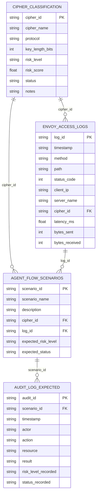

# Observability & Data Model Framework

**Version**: 1.0.0  
**Last Updated**: 2026-04-06  
**Status**: Planning Phase

---

## Overview

This document defines the observability framework for the PQC Envoy Filter, integrating with the existing data model for cipher risk analysis, traffic parsing, agent flows, and audit expectations.

---

## Data Model Integration

### Existing Data Model Structure

The project uses a comprehensive data model (`data_setup v1.0.0`) with the following components:

#### 1. Cipher Classification (`01_cipher_classification.csv`)
**Purpose**: Cipher inventory with risk labels and metadata

**Schema**:
- `cipher_id` (string, PK): Unique cipher identifier
- `cipher_name` (string): Human-readable cipher name
- `protocol` (string): TLS/SSL protocol version
- `key_length_bits` (integer): Key size in bits
- `risk_level` (string): Risk classification (HIGH/MEDIUM/LOW)
- `risk_score` (number): Numerical risk score
- `status` (string): Cipher status (ACTIVE/DEPRECATED/BLOCKED)
- `notes` (string): Additional metadata

**PQC Integration**:
- Add PQC cipher suites: ML-KEM-768, ML-DSA-65, SLH-DSA-128s
- Hybrid ciphers: TLS_AES_128_GCM_SHA256 + ML-KEM-768
- Risk levels: PQC = LOW, Hybrid = LOW, Classical = MEDIUM/HIGH

#### 2. Envoy Access Logs (`02_envoy_access_logs.csv`)
**Purpose**: Sample Envoy HTTP access logs

**Schema**:
- `log_id` (string, PK): Unique log entry identifier
- `timestamp` (string): ISO 8601 timestamp
- `method` (string): HTTP method
- `path` (string): Request path
- `status_code` (integer): HTTP status code
- `client_ip` (string): Client IP address
- `server_name` (string): Server hostname
- `cipher_id` (string, FK): References cipher_classification
- `latency_ms` (number): Request latency
- `bytes_sent` (integer): Response size
- `bytes_received` (integer): Request size

**PQC Enhancements**:
- Add `pqc_mode` (string): PQC/HYBRID/CLASSICAL
- Add `pqc_negotiation_time_ms` (number): PQC handshake duration
- Add `fallback_triggered` (boolean): Whether fallback occurred
- Add `policy_decision` (string): Policy engine decision

#### 3. Agent Flow Scenarios (`04_agent_flow_scenarios.csv`)
**Purpose**: Agent workflow test scenarios

**Schema**:
- `scenario_id` (string, PK): Unique scenario identifier
- `scenario_name` (string): Human-readable name
- `description` (string): Scenario description
- `cipher_id` (string, FK): References cipher_classification
- `log_id` (string, FK): References envoy_access_logs
- `expected_risk_level` (string): Expected risk classification
- `expected_status` (string): Expected cipher status

**Multi-Agent Integration**:
- Map to Architect/Planner scenarios
- Map to Filter Engineer test cases
- Map to SRE/Observability monitoring scenarios
- Map to Security/Crypto validation scenarios

#### 4. Audit Log Expected (`05_audit_log_expected.csv`)
**Purpose**: Expected audit log rows per scenario

**Schema**:
- `audit_id` (string, PK): Unique audit entry identifier
- `scenario_id` (string, FK): References agent_flow_scenarios
- `timestamp` (string): ISO 8601 timestamp
- `actor` (string): Agent or system component
- `action` (string): Action performed
- `resource` (string): Resource affected
- `result` (string): Action result
- `risk_level_recorded` (string): Recorded risk level
- `status_recorded` (string): Recorded status

**PQC Audit Events**:
- `PQC_HANDSHAKE_SUCCESS`: Successful PQC negotiation
- `PQC_HANDSHAKE_FAILURE`: Failed PQC negotiation
- `PQC_FALLBACK_TRIGGERED`: Fallback to classical crypto
- `PQC_POLICY_DECISION`: Policy engine decision
- `PQC_CONFIG_UPDATE`: Configuration change
- `PQC_CIPHER_ROTATION`: Cipher suite rotation

---

## Data Relationships



---

## Metrics Framework

### Connection Metrics

**pqc_connections_total**
- Type: Counter
- Labels: `cipher_id`, `pqc_mode`, `risk_level`, `status`
- Description: Total PQC connections established
- Data Source: `envoy_access_logs.cipher_id` + `cipher_classification`

**pqc_connections_active**
- Type: Gauge
- Labels: `cipher_id`, `pqc_mode`
- Description: Currently active PQC connections
- Data Source: Real-time connection tracking

**classical_connections_total**
- Type: Counter
- Labels: `cipher_id`, `risk_level`
- Description: Total classical crypto connections
- Data Source: `envoy_access_logs` where `pqc_mode = CLASSICAL`

### Handshake Metrics

**pqc_handshake_duration_seconds**
- Type: Histogram
- Labels: `cipher_id`, `pqc_mode`
- Buckets: [0.001, 0.005, 0.01, 0.05, 0.1, 0.5, 1.0]
- Description: PQC handshake duration
- Data Source: `envoy_access_logs.pqc_negotiation_time_ms`

**pqc_handshake_failures_total**
- Type: Counter
- Labels: `cipher_id`, `failure_reason`, `risk_level`
- Description: Failed PQC handshakes
- Data Source: `audit_log` where `action = PQC_HANDSHAKE_FAILURE`

**pqc_fallback_events_total**
- Type: Counter
- Labels: `cipher_id`, `fallback_reason`
- Description: Fallback to classical crypto events
- Data Source: `audit_log` where `action = PQC_FALLBACK_TRIGGERED`

### Policy Metrics

**pqc_policy_decisions_total**
- Type: Counter
- Labels: `decision`, `service`, `route`, `environment`
- Description: Policy engine decisions
- Data Source: `audit_log` where `action = PQC_POLICY_DECISION`

**pqc_feature_flag_checks_total**
- Type: Counter
- Labels: `flag_name`, `result`, `service`
- Description: Feature flag evaluations
- Data Source: Feature flag service integration

**pqc_route_policy_hits_total**
- Type: Counter
- Labels: `route`, `policy_type`, `result`
- Description: Route-specific policy hits
- Data Source: Policy engine logs

### Security Metrics

**pqc_downgrade_attempts_total**
- Type: Counter
- Labels: `cipher_id`, `client_ip`, `blocked`
- Description: Detected downgrade attempts
- Data Source: Security monitoring + `audit_log`

**pqc_cipher_suite_usage**
- Type: Gauge
- Labels: `cipher_id`, `cipher_name`, `risk_level`
- Description: Current cipher suite distribution
- Data Source: `cipher_classification` + active connections

**pqc_certificate_errors_total**
- Type: Counter
- Labels: `error_type`, `cipher_id`
- Description: Certificate validation errors
- Data Source: TLS validation logs

### Risk Analysis Metrics

**pqc_risk_score_distribution**
- Type: Histogram
- Labels: `risk_level`
- Buckets: [0, 0.2, 0.4, 0.6, 0.8, 1.0]
- Description: Distribution of cipher risk scores
- Data Source: `cipher_classification.risk_score`

**pqc_high_risk_connections_total**
- Type: Counter
- Labels: `cipher_id`, `client_ip`, `server_name`
- Description: Connections using high-risk ciphers
- Data Source: `envoy_access_logs` JOIN `cipher_classification` WHERE `risk_level = HIGH`

---

## Logging Framework

### Structured Log Format

```json
{
  "timestamp": "2026-04-06T07:00:00.000Z",
  "level": "info|warn|error",
  "message": "Human-readable message",
  "log_id": "unique-log-identifier",
  "cipher_id": "cipher-identifier",
  "cipher_name": "TLS_ML_KEM_768_SHA256",
  "pqc_mode": "PQC|HYBRID|CLASSICAL",
  "risk_level": "HIGH|MEDIUM|LOW",
  "risk_score": 0.15,
  "status": "ACTIVE|DEPRECATED|BLOCKED",
  "latency_ms": 3.2,
  "client_ip": "192.168.1.100",
  "server_name": "api.example.com",
  "method": "GET",
  "path": "/api/v1/resource",
  "status_code": 200,
  "bytes_sent": 1024,
  "bytes_received": 512,
  "fallback_triggered": false,
  "policy_decision": "ALLOW_PQC",
  "scenario_id": "scenario-001",
  "actor": "pqc_filter",
  "action": "PQC_HANDSHAKE_SUCCESS",
  "resource": "connection-12345",
  "result": "SUCCESS"
}
```

### Log Levels

**INFO**: Normal operations
- PQC handshake success
- Policy decisions (allow)
- Configuration updates

**WARN**: Potential issues
- Fallback to classical crypto
- High-risk cipher usage
- Policy decisions (deny)
- Performance degradation

**ERROR**: Failures
- PQC handshake failures
- Certificate validation errors
- Configuration errors
- Security violations

---

## Audit Trail

### Audit Event Types

Based on `audit_log_expected` schema:

1. **PQC_HANDSHAKE_SUCCESS**
   - Actor: `pqc_filter`
   - Resource: `connection-{id}`
   - Result: `SUCCESS`
   - Risk Level: From `cipher_classification`

2. **PQC_HANDSHAKE_FAILURE**
   - Actor: `pqc_filter`
   - Resource: `connection-{id}`
   - Result: `FAILURE`
   - Includes failure reason

3. **PQC_FALLBACK_TRIGGERED**
   - Actor: `fallback_manager`
   - Resource: `connection-{id}`
   - Result: `FALLBACK_TO_CLASSICAL`
   - Includes trigger reason

4. **PQC_POLICY_DECISION**
   - Actor: `policy_engine`
   - Resource: `service-{name}`
   - Result: `ALLOW_PQC|DENY_PQC|REQUIRE_HYBRID`

5. **PQC_CONFIG_UPDATE**
   - Actor: `config_manager`
   - Resource: `config-{type}`
   - Result: `SUCCESS|FAILURE`

6. **PQC_CIPHER_ROTATION**
   - Actor: `key_manager`
   - Resource: `cipher-{id}`
   - Result: `SUCCESS|FAILURE`

---

## Test Intent & Validation

### Goals (from data model)

1. **Validate cipher risk classification logic**
   - Test: `cipher_classification` risk scoring
   - Assertion: Risk levels match NIST guidelines
   - Data: `01_cipher_classification.csv`

2. **Validate parsing and enrichment of Envoy access logs**
   - Test: Log parsing and cipher lookup
   - Assertion: `cipher_id` correctly joined with classification
   - Data: `02_envoy_access_logs.csv` + `01_cipher_classification.csv`

3. **Validate end-to-end agent flows**
   - Test: Complete request → audit log flow
   - Assertion: Audit logs match expected output
   - Data: `04_agent_flow_scenarios.csv` + `05_audit_log_expected.csv`

4. **Detect regressions in risk scoring**
   - Test: Risk score calculation consistency
   - Assertion: Scores remain stable across versions
   - Data: Historical `cipher_classification` snapshots

---

## Dashboard Definitions

### PQC Adoption Dashboard

**Panels**:
1. Connection Ratio (PQC vs Classical)
   - Query: `rate(pqc_connections_total[5m]) / rate(classical_connections_total[5m])`
   - Visualization: Time series graph

2. Cipher Suite Distribution
   - Query: `pqc_cipher_suite_usage`
   - Visualization: Pie chart
   - Labels: `cipher_name`, `risk_level`

3. Risk Level Distribution
   - Query: `sum by (risk_level) (pqc_connections_total)`
   - Visualization: Bar chart
   - Data Source: `cipher_classification.risk_level`

### PQC Health Dashboard

**Panels**:
1. Handshake Success Rate
   - Query: `rate(pqc_handshake_duration_seconds_count[5m]) - rate(pqc_handshake_failures_total[5m])`
   - Visualization: Gauge (0-100%)

2. Handshake Latency (P50, P95, P99)
   - Query: `histogram_quantile(0.95, pqc_handshake_duration_seconds_bucket)`
   - Visualization: Time series graph
   - Data Source: `envoy_access_logs.pqc_negotiation_time_ms`

3. Fallback Event Rate
   - Query: `rate(pqc_fallback_events_total[5m])`
   - Visualization: Time series graph
   - Alert: Rate > 0.1 (10% fallback rate)

### PQC Security Dashboard

**Panels**:
1. Downgrade Attempts
   - Query: `increase(pqc_downgrade_attempts_total[1h])`
   - Visualization: Time series graph
   - Alert: Any increase triggers alert

2. High-Risk Cipher Usage
   - Query: `sum by (cipher_name) (pqc_high_risk_connections_total)`
   - Visualization: Table
   - Data Source: `cipher_classification` WHERE `risk_level = HIGH`

3. Certificate Errors
   - Query: `rate(pqc_certificate_errors_total[5m])`
   - Visualization: Time series graph
   - Alert: Rate > 0.01 (1% error rate)

---

## Integration with Multi-Agent Workflows

### Architect/Planner Agent
- **Uses**: `agent_flow_scenarios` for planning
- **Produces**: Architecture decisions in `audit_log`
- **Monitors**: Risk score distribution, cipher classification

### Filter Engineer Agent
- **Uses**: `envoy_access_logs` for testing
- **Produces**: Implementation logs in `audit_log`
- **Monitors**: Handshake metrics, latency metrics

### SRE/Observability Agent
- **Uses**: All metrics and logs
- **Produces**: Dashboard configs, alert rules
- **Monitors**: All dashboards, alert firing rate

### Security/Crypto Agent
- **Uses**: `cipher_classification`, security metrics
- **Produces**: Security audit logs
- **Monitors**: Downgrade attempts, high-risk usage

### Orchestrator Agent
- **Uses**: `agent_flow_scenarios`, `audit_log_expected`
- **Produces**: Orchestration logs
- **Monitors**: Scenario completion, audit log compliance

---

## Next Steps

1. **Phase 2**: Implement metrics collection in C++ filter
2. **Phase 3**: Create Prometheus exporters
3. **Phase 4**: Build Grafana dashboards
4. **Phase 5**: Implement structured logging
5. **Phase 6**: Set up audit trail storage
6. **Phase 7**: Create test data generators
7. **Phase 8**: Validate against expected outputs

---

## References

- Data Model: `data_setup v1.0.0`
- Prometheus Documentation: https://prometheus.io/docs/
- Grafana Documentation: https://grafana.com/docs/
- Envoy Observability: https://www.envoyproxy.io/docs/envoy/latest/intro/arch_overview/observability/observability