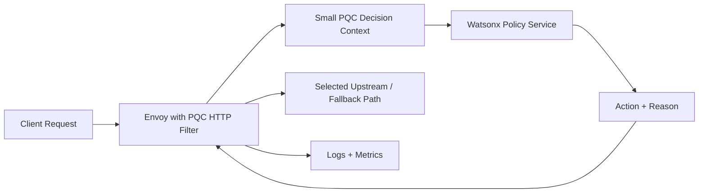

# Watsonx PQC MVP Plan

This document turns the current repo into one thin MVP slice:

- Envoy PQC filter gathers a small decision context
- a Watsonx-backed policy service evaluates that context
- the service returns one bounded action
- Envoy applies that action and records the result

## Goal

Deliver a local demo where the PQC filter extracts request and TLS metadata, prepares a decision payload, and can hand that payload to a Watsonx-oriented policy service.

For the MVP, the most important thing is not "many agents".
The most important thing is one reliable decision loop.

## Component Diagram



## Small Context Gathered by the Filter

The filter now gathers the fields below as the starting decision payload:

- `pqc_capable`
- `cipher_suite`
- `tls_version`
- `client_ip`
- `sni`
- `request_method`
- `request_path`
- `authority`
- `service_name`
- `mode`

These fields are intentionally small and deterministic so they are safe to use in a policy request.

## Decision Request Schema

See:

- [PQC_AGENT_REQUEST_SCHEMA.json](/c:/Users/steph/Desktop/docs/PQC_AGENT_REQUEST_SCHEMA.json)
- [PQC_AGENT_RESPONSE_SCHEMA.json](/c:/Users/steph/Desktop/docs/PQC_AGENT_RESPONSE_SCHEMA.json)

Example request:

```json
{
  "service_name": "payments.internal",
  "authority": "payments.internal:8443",
  "request_method": "GET",
  "request_path": "/agent/decision",
  "client_ip": "10.0.0.3:50000",
  "sni": "api.quantum.internal",
  "tls_version": "TLSv1.3",
  "cipher_suite": "TLS_ML_KEM_768_SHA256",
  "pqc_capable": true,
  "mode": "hybrid"
}
```

Example response:

```json
{
  "action": "prefer_hybrid",
  "reason": "Client negotiated a PQC-capable cipher and can stay on the hybrid path."
}
```

## Allowed Actions

Keep the response bounded for the MVP:

- `allow`
- `prefer_hybrid`
- `fallback`
- `deny`

This keeps Envoy deterministic and fast while still letting Watsonx act as the decision layer.

## First Demo Scenario

Use one simple scenario for the MVP demo:

1. A PQC-capable request reaches Envoy.
2. The filter extracts TLS and request metadata.
3. Envoy builds the policy request payload.
4. The policy service returns `prefer_hybrid`.
5. Envoy logs the decision and continues on the hybrid path.

Use one fallback scenario too:

1. A classical-only request reaches Envoy.
2. The filter extracts the same metadata.
3. The policy service returns `fallback`.
4. Envoy records the fallback decision and continues on the classical-safe path.

## Recommended Build Order

1. Filter-side context extraction
2. Decision request/response contract
3. Local stub policy endpoint
4. Envoy adapter/client for policy calls
5. Watsonx-backed implementation behind the same contract
6. Logs and metrics for decision outcomes

## First Three Implementation Files for the Next Slice

When you wire the actual policy call, create these next:

1. `src/filters/pqc/agent_policy_client.h`
2. `src/filters/pqc/agent_policy_client.cc`
3. `test/filters/pqc/agent_policy_client_test.cc`

Suggested responsibility split:

- `agent_policy_client.*`
  Builds the outbound payload and interprets the decision response

- `pqc_filter.*`
  Extracts context and invokes the client

- tests
  Verify that extracted context becomes the expected policy request

## What the Repo Has After This Step

After the current step, the repo should already support:

- extracting a stable, small context from the request and TLS connection
- deriving a service name from authority or SNI
- exposing that context for tests and future adapters
- documenting the Watsonx policy contract

That gives you a clean handoff point to add the actual Watsonx policy service next without reworking the filter extraction logic.
